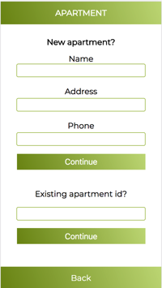
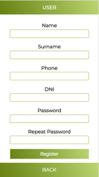
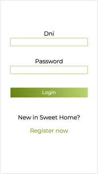
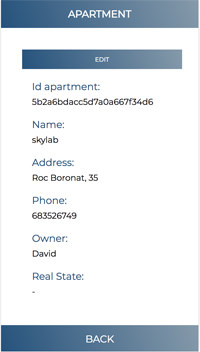
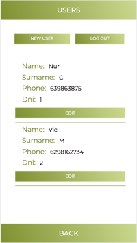
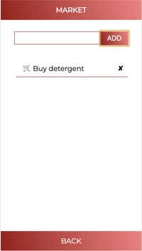
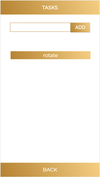
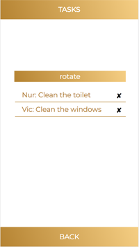
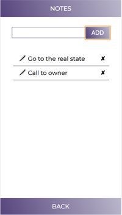
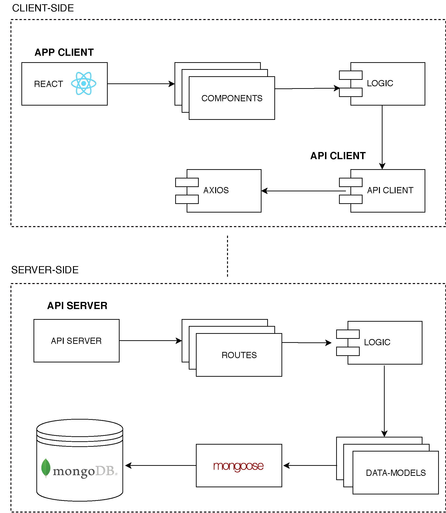

# SWEET HOME: sweet living.

                                           

## Target
### Sweet Home is an app for have a better relationship with your  roommates. Making cohabitation easier.

## Functional description
### This application allows you to make coexistence easier through different sections, such as cleaning tasks, assigning and rotating every week, another is that you have the information about the apartment and your roommates, another is a notebook...

## Screenshot
                              

Surge

## Technical description

* React
* HTML5
* CSS3
* Javascript
* Node
* Mocha
* Mongoose
* MongoDB

## General structure

### Data model

## Developer

Núria Coma (https://github.com/NuriaComa)