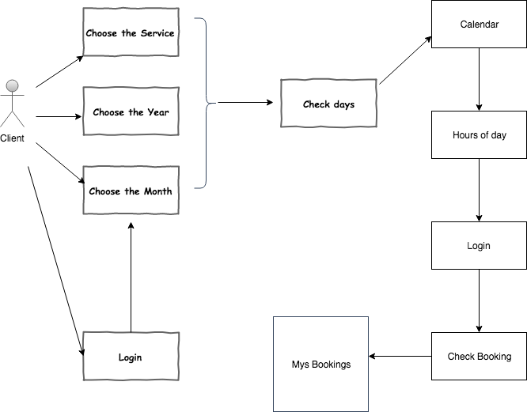

# Style Booking 

(http://stylebooking.surge.sh/)

Style Booking is a hairdresser managing tool where you can choose the service with the duration and price, and where you can manage your reservation faster

# Functional description

# Technical description

* React
* react router
* Javascript
* Node
* MongoDB
* Mongoose
* TDD (Mocha/ chai)
* HTML5
* CSS3
* Bulma

## Deploy

To deploy you need to go to the client and make a npm install, then go to the app folder and make a npm start

## General structure

### Schema

### Components

### Data model

# Screenshots 

## Landing

------------------
## Login

------------------
## Register

------------------
## Calendar

------------------
## Profile

------------------

