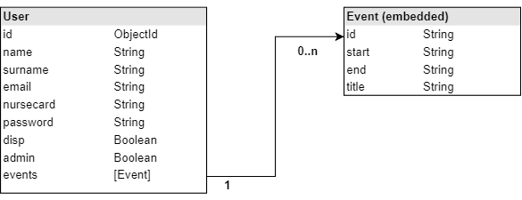
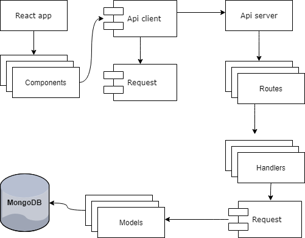
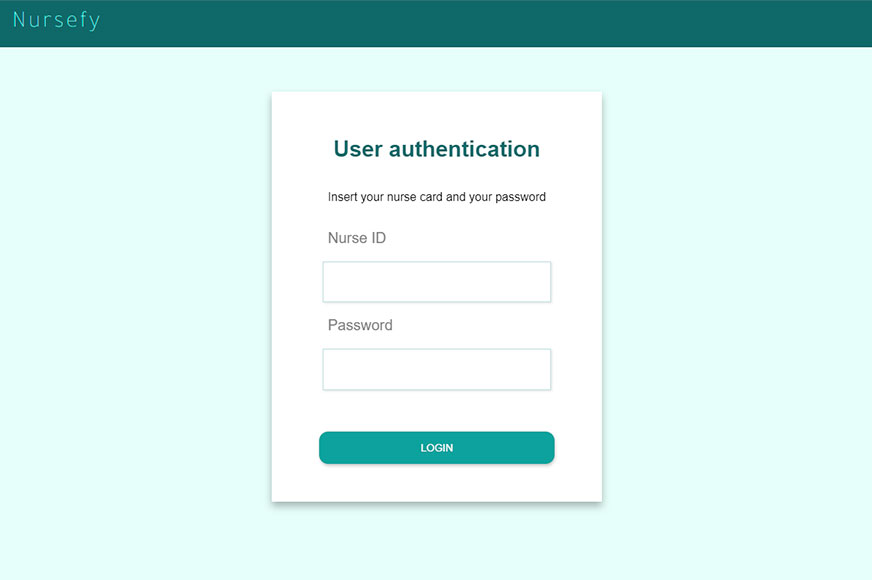

# Nursefy App

The project Nursefy is a web app that allows you to easily view and manage the nurse's shifts in a hospital.

## Technical description

### Data model

### Block model

## Demo
### Screenshots

## Tecnologies

|Client-side               |Server-side                      |Testing
|-----------------------------------------------|-----------------------------|----------------|
|React                          |Node.js        |Mocha
|Css3                        |Express.js | Chai
|Html                     |MongoDB, Mongoose|
