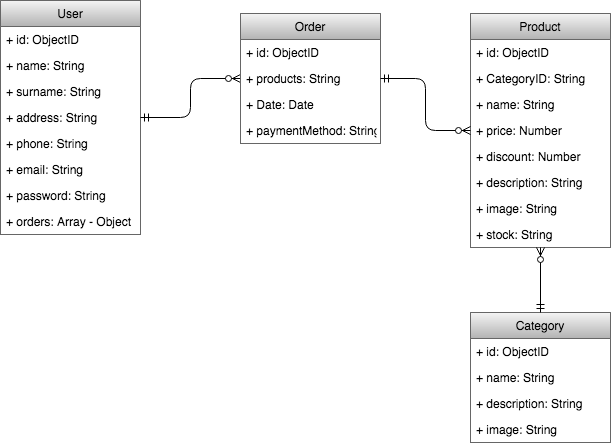
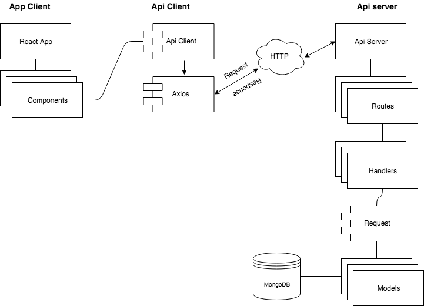
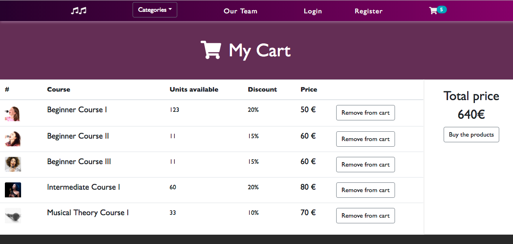

# SINGING-LAB

# 

## TARGET

This project is an [e-commerce](https://en.wikipedia.org/wiki/E-commerce) designed to sell online singing courses and products. Intended to bring and easy and comfortable way to purchase and improve your singing skills wherever you are and whenever you want to. 

## TECHNOLOGIES

| Transversal | Server-side | Client-side | Testing |
| :---------: |:-------: |:----------: |:---------: |
| Agile Methodology | Node.js, express.js  | React | Mocha |
| javascript (ES5, ES6) | MongoDB, Mongoose | CSS3 | Chai |
| HTML |Pug | Bootstrap | NYC (Istambul) |

- Other: [Trello](https://trello.com/b/eriWR8jg/final-project), Git & Github, surge, cloudinary, Draw.io. 

## DATA MODEL

## BLOCK MODEL

## DESIGN (screenshots)

### Home Page

### Login

### Register

### Products

### Product details

### Cart

## DEMO

You can see a demo of the project here: surge

## Sprint Plan

