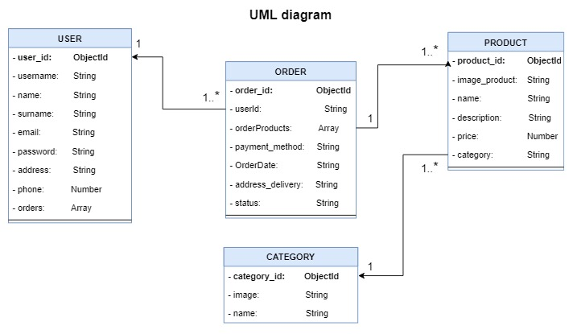
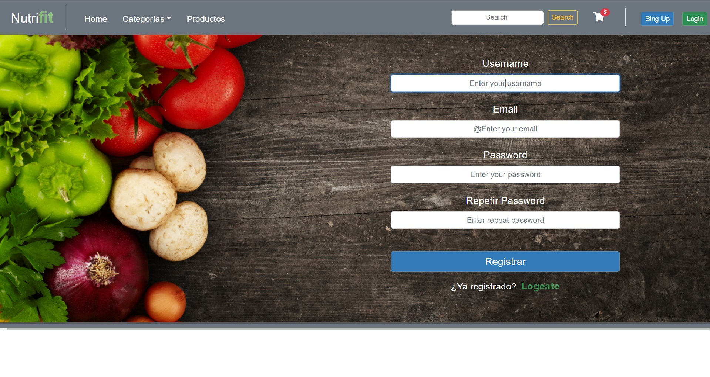
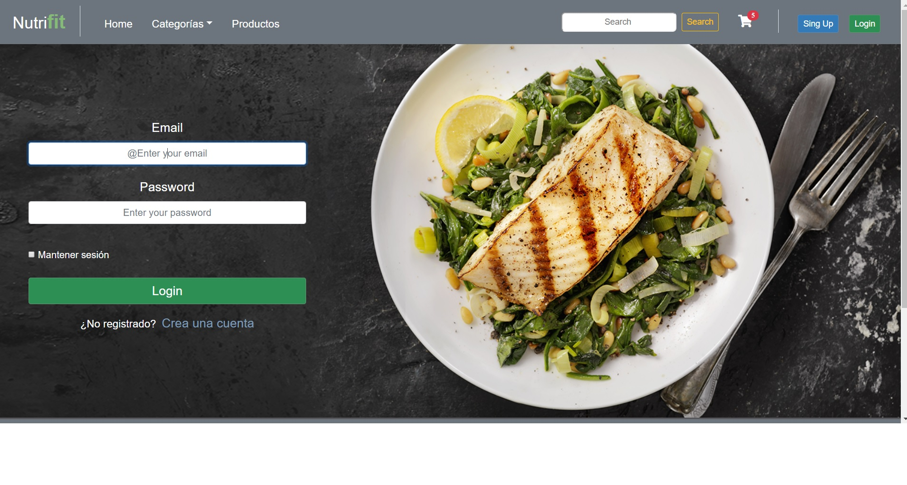
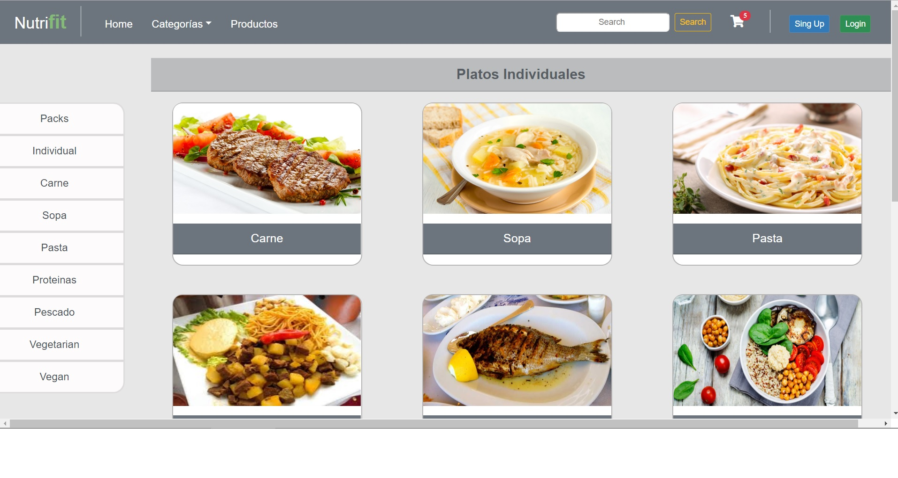
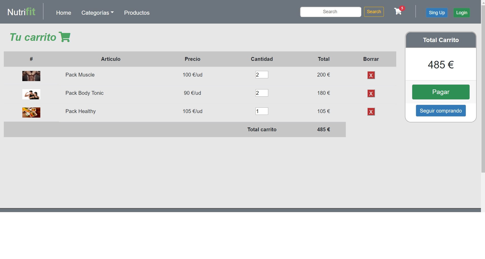
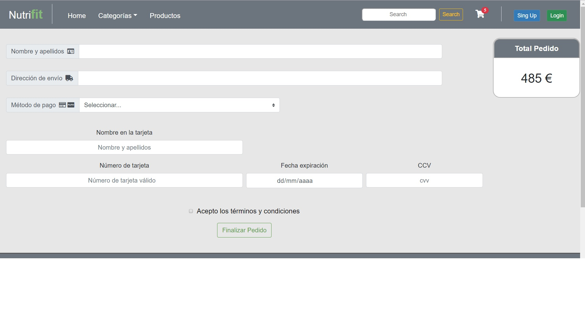

# NUTRI-FIT 💪

## TARGET

E-comerce web platform focused on the sale of nutritional food products. The sale of these products is aimed at people looking for a specific diet. For this, both individual dishes and specialized packages are available for a type of nutritional plan.

## TECHNOLOGIES 

#### - CLIENT SIDE
* Javascript
* HTML5
* CSS3
* Bootstrap
* React

#### - SERVER SIDE
* Node
* Express.js
* MongoDB
* Mongoose

#### - TESTING
* Mocha
* Chai
* NYC

## UML MODEL

## BLOCK MODEL

## SCREENSHOTS

###  * Register

### * Login

### * Home 

### * Individuals Category

### * Cart

### * Order

## SHOW DEMO

Try a demo of the project here: surge
