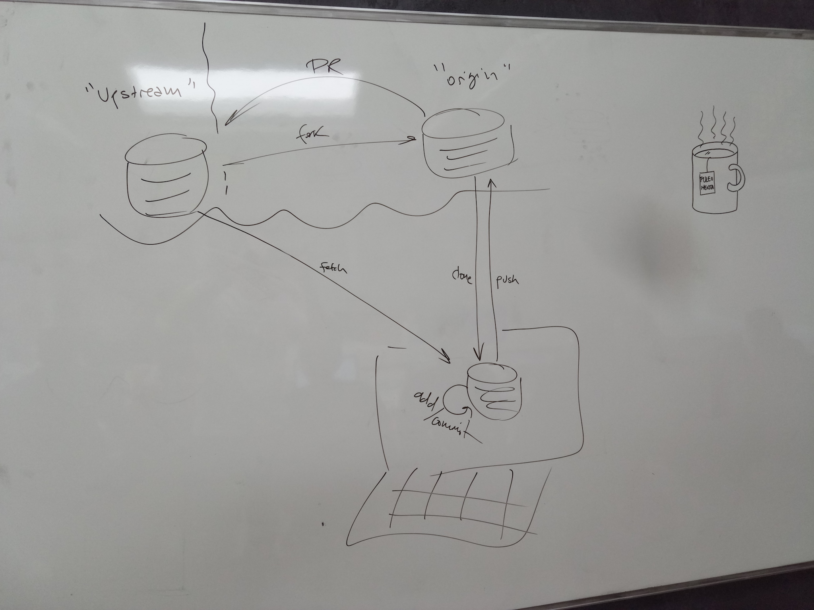
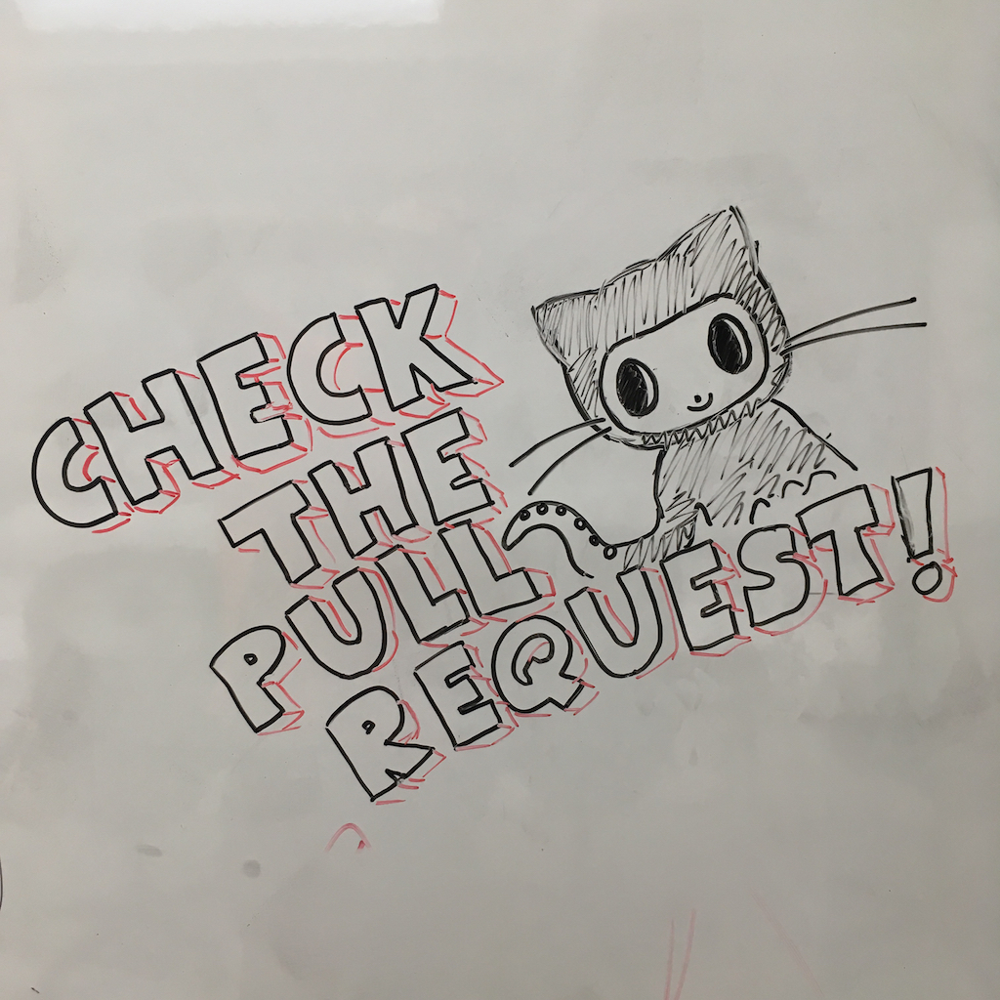

# [Cheatsheet](https://gist.github.com/LeCoupa/122b12050f5fb267e75f)

# pull-request





## [Checking out pull requests locally](https://help.github.com/articles/checking-out-pull-requests-locally/)

- Example

```sh
$ git fetch upstream pull/85/head:pr

$ git checkout pr
```

# references

[GitHub Learning Lab](https://lab.github.com/)

[Learning Git Branching](https://learngitbranching.js.org/)