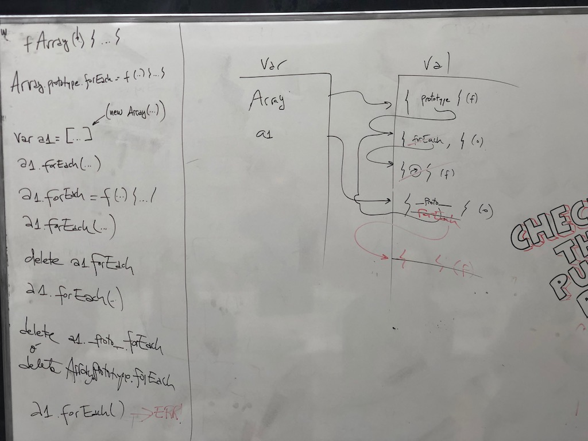

# functions

[Function](https://developer.mozilla.org/en-US/docs/Web/JavaScript/Reference/Global_Objects/Function)

[function expression](https://developer.mozilla.org/en-US/docs/Web/JavaScript/Reference/Operators/function)

[function declaration](https://developer.mozilla.org/en-US/docs/Web/JavaScript/Reference/Statements/function)

[First-class Function](https://developer.mozilla.org/en-US/docs/Glossary/First-class_Function)

[What is meant by 'first class object'?](https://stackoverflow.com/questions/705173/what-is-meant-by-first-class-object)

# higher-order function

```js
function filter(arr, func) {
     var res = [];

     for (var i = 0; i < arr.length; i++) {
         var val = arr[i];

         if (func(val)) res.push(val);
     }

    return res;
}
```

# recursion

[Understanding Recursion in JavaScript](https://medium.com/@zfrisch/understanding-recursion-in-javascript-992e96449e03)

[Recursion in JavaScript](https://www.codecademy.com/es/courses/javascript-lesson-205/0/1)


# scope & context

```js
// what's the result?

var fun;

for (var i = 0; i < 3; i++) if (i === 2) fun = function() { return i; };

fun(); // -> 3 // why!?

// how to implement the following?

concat(1).concat(2).toString(); // -> "1 2"

// first approach

function concat(text) {
	return {
	    concat: function(nextText) {
			return {
                toString: function() {
                    return text + ' ' + nextText;
                }                
            };
        }
    };
}

// what if requiring to concat a variable number of times in one statement?

concat(1).concat(2).toString(); // -> "1 2"
concat(1).concat(2).concat(3).toString(); // -> "1 2 3"
concat(1).concat(2).concat(3).concat(4).toString(); // -> "1 2 3 4"

function concat(text) {
	var accum = text;

	return {
		concat: function(text) {
			accum += ' ' + text;

			return this;
        },

		toString: function() {
			return accum;
        }
    };
}

// what happens if...

concat(1).concat(2).concat(3).toString().concat(4); // -> "1 2 34" -> 3 and 4 are concatenated in a different manner! (no space in-between)

// why is this happening!? mmm... may doc about String.prototype.concat() help? ;)

```

[Understanding Scope and Context in JavaScript](http://ryanmorr.com/understanding-scope-and-context-in-javascript/)

[Everything you wanted to know about JavaScript scope](https://toddmotto.com/everything-you-wanted-to-know-about-javascript-scope/)


# chaining methods (aka method chaining or chainable or cascading)

```js
a().b().c().d().e();
```

# self-invoking function

```js
var funA;
(function() {
	funA = function(text) { return wtf(text); }

	function wtf(text) { return text + '!!!'; }
})();


var funB;
(function() {
	funB = function(text) { return wtf(text); }

	function wtf(text) { return text + '???'; }
})();

// NOTE: as wtf() is defined each one in its own scope, they do not collide 👍

funA('hola');
"hola!!!"
funB('hola');
"hola???"
```

[IIFE (Immediately Invoked Function Expression) is a JavaScript function that runs as soon as it is defined](https://developer.mozilla.org/en-US/docs/Glossary/IIFE)

# constructor function & prototype



# [prototype & inheritance](prototype-inheritance)

[Javascript inheritance behind the scene __proto__, [[prototype]] and prototype](https://hackernoon.com/understand-nodejs-javascript-object-inheritance-proto-prototype-class-9bd951700b29)

[JavaScript's Pseudo Classical Inheritance diagram](https://kenneth-kin-lum.blogspot.com.es/2012/10/javascripts-pseudo-classical.html)

# references

[Colorful console.log](https://coderwall.com/p/fskzdw/colorful-console-log)

[A Tricky JavaScript Interview Question Asked by Google and Amazon](https://medium.com/coderbyte/a-tricky-javascript-interview-question-asked-by-google-and-amazon-48d212890703)

[Entendiendo los tipos en JS](https://medium.com/entendiendo-javascript/entendiendo-los-tipos-en-javascript-4c1c718e8e2a)

[Entendiendo this en JS](https://medium.com/entendiendo-javascript/entendiendo-this-javascript-cba60c8cec8c)

[Asynchronous JS](https://www.youtube.com/playlist?list=PL4cUxeGkcC9jAhrjtZ9U93UMIhnCc44MH)

[The Modern Javascript Tutorial](https://javascript.info/)

[JS - The Definitive Guide](http://www.stilson.net/documentation/javascript.pdf)

[Annotated ECMAScript 5.1 ](http://es5.github.io)

